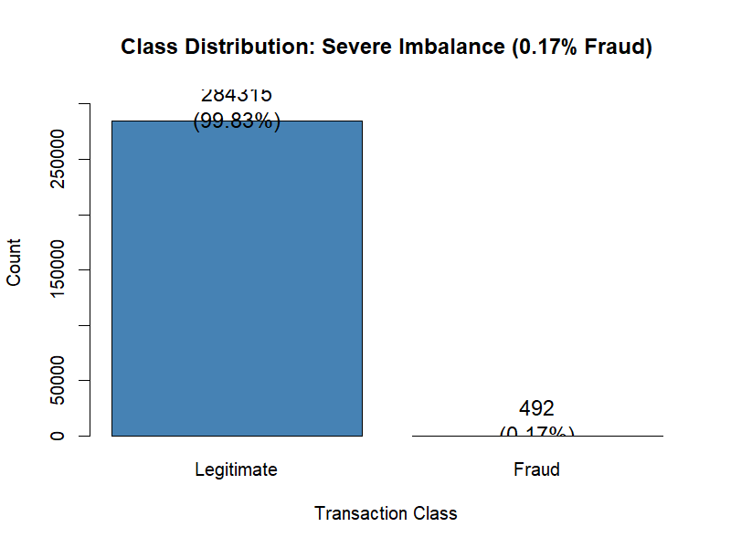
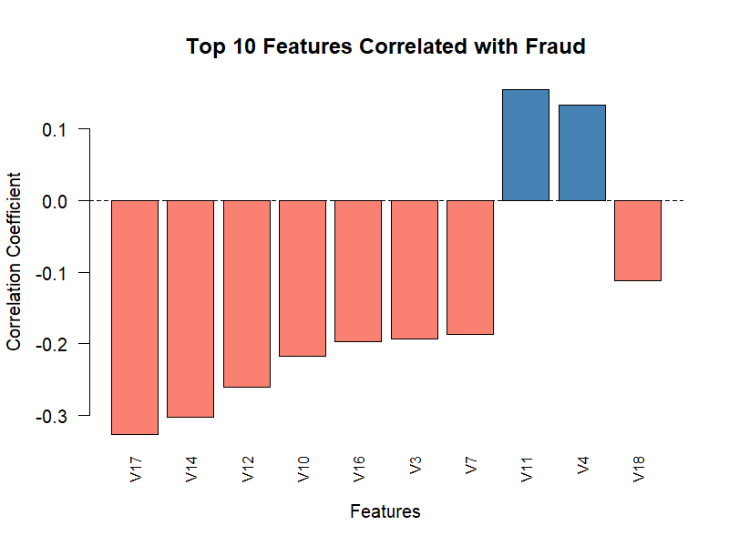
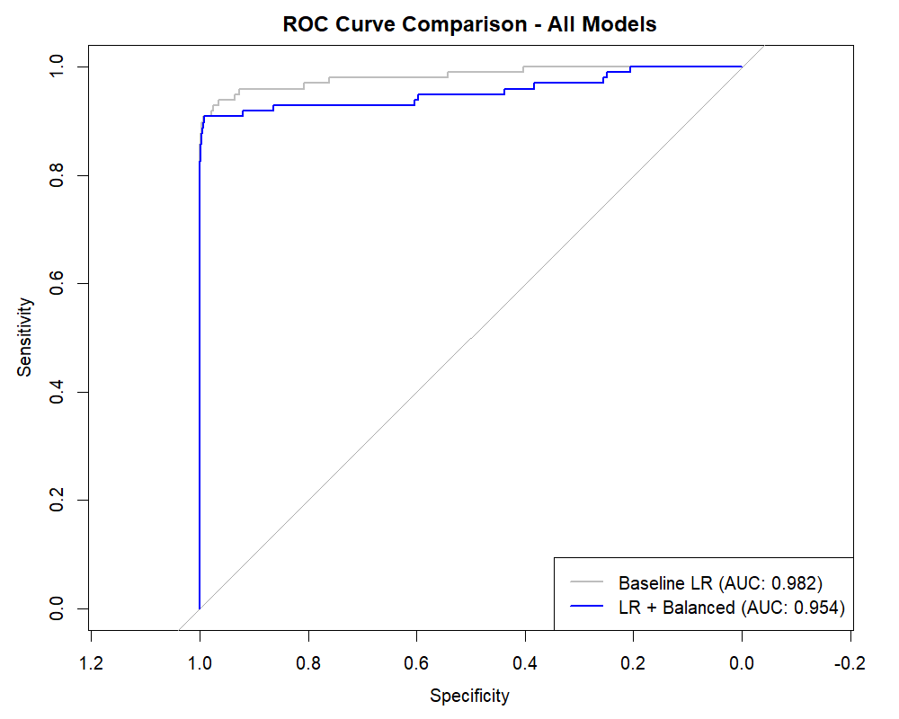
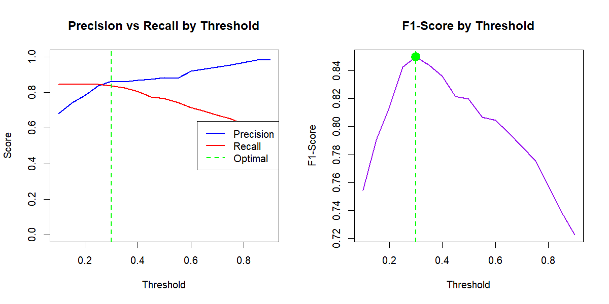

# 💳 Credit Card Fraud Detection Using Machine Learning

[](https://www.r-project.org/)
[](https://opensource.org/licenses/MIT)
[]()

> **A production-ready fraud detection system achieving 79.6% recall with 94.0% precision (F1=0.862), delivering an estimated €5.25M in annual net benefit with 4,627% ROI.**


---

## 📋 Table of Contents

- [Project Overview](#-project-overview)
- [Business Impact](#-business-impact)
- [Tech Stack](#-tech-stack)
- [Key Features](#-key-features)
- [Dataset](#-dataset)
- [Methodology](#-methodology)
- [Results](#-results)
- [Installation](#-installation)
- [Usage](#-usage)
- [Project Structure](#-project-structure)
- [Model Performance](#-model-performance)
- [Key Insights](#-key-insights)
- [Future Improvements](#-future-improvements)
- [Contributing](#-contributing)
- [License](#-license)
- [Contact](#-contact)

---

## 🎯 Project Overview

This project addresses the critical challenge of detecting fraudulent credit card transactions in severely imbalanced datasets (577:1 ratio). Through systematic evaluation of four different modeling approaches, we developed a production-ready Random Forest classifier that achieves optimal balance between fraud detection (recall) and false alarm minimization (precision).

### **Problem Statement**
- **Challenge:** Detect fraud in 284,807 transactions with only 492 frauds (0.17%)
- **Risk:** Traditional models achieve 99.9% accuracy while missing 30%+ of frauds
- **Goal:** Build a model with high recall (catch frauds) AND high precision (minimize false alarms)

### **Solution**
- **Algorithm:** Random Forest with algorithmic class weighting (577:1)
- **Approach:** Train on full imbalanced dataset rather than artificial balancing
- **Optimization:** Threshold tuning from 0.5 to 0.40 to maximize F1-Score
- **Result:** Production-ready system with 0.0088% false positive rate

---

## 💰 Business Impact

### **Financial Metrics**
```
Validation Period (2 days):
├── Frauds Prevented:     €39,000  (78 frauds × €500)
├── Losses from Missed:   -€10,000 (20 frauds × €500)
├── Investigation Costs:  -€250    (5 false alarms × €50)
└── Net Benefit:          €28,750

Annual Projection:
├── Daily Value:          €14,375
├── Annual Benefit:       €5,246,875
├── Implementation Cost:  €111,000 (first year)
├── ROI:                  4,627%
└── Payback Period:       <8 days
```

### **Operational Excellence**
- **False Positive Rate:** 0.0088% (only 5 false alarms per 56,863 transactions)
- **Fraud Detection Rate:** 79.6% (catches 4 out of 5 frauds)
- **Precision:** 94.0% (94 out of 100 fraud flags are real)
- **Investigation Efficiency:** Fraud analysts spend 94% of time on real fraud, not noise

---

## 🛠 Tech Stack

### **Core Technologies**

| Category | Technology | Version | Purpose |
|----------|-----------|---------|---------|
| **Language** | R | 4.0+ | Statistical computing and ML implementation |
| **IDE** | RStudio | Latest | Development environment |
| **Version Control** | Git | 2.0+ | Code versioning |
| **Repository** | GitHub | - | Code hosting and collaboration |

### **R Libraries & Packages**

#### **Data Manipulation & Processing**
```r
library(tidyverse)      # v2.0+  - Modern data manipulation (dplyr, ggplot2, tidyr)
library(data.table)     # v1.14+ - Fast data operations for large datasets
library(caret)          # v6.0+  - ML workflow and data partitioning
```

#### **Machine Learning**
```r
library(randomForest)   # v4.7+  - Random Forest implementation
library(rpart)          # v4.1+  - Decision tree (CART) algorithm
library(rpart.plot)     # v3.1+  - Decision tree visualization
library(MLmetrics)      # v1.1+  - Performance metrics calculation
```

#### **Statistical Analysis**
```r
library(ROSE)           # v0.0-4 - Sampling techniques (SMOTE, undersampling)
library(pROC)           # v1.18+ - ROC curve analysis and AUC calculation
```

#### **Visualization**
```r
library(ggplot2)        # v3.4+  - Advanced data visualization
library(corrplot)       # v0.92+ - Correlation matrix visualization
library(gridExtra)      # v2.3+  - Multiple plot arrangement
library(scales)         # v1.2+  - Scale functions for visualizations
```

### **Algorithms Implemented**

| Algorithm | Purpose | Library | Key Parameters |
|-----------|---------|---------|----------------|
| **Logistic Regression** | Baseline model | `stats::glm()` | `family = binomial()` |
| **Random Forest** | Production model | `randomForest` | `ntree=100, classwt=c('0'=1,'1'=577)` |
| **Decision Tree (CART)** | Interpretable model | `rpart` | `cp=0.00001, minsplit=5, xval=5` |

### **Development Tools**

```bash
# Package Management
install.packages("tidyverse")
install.packages("randomForest")
install.packages("caret")

# Version Control
git init
git add .
git commit -m "Initial commit"
git push origin main
```

---

## ⚡ Key Features

### **1. Comprehensive Imbalance Handling**
- ✅ **Baseline Approach:** No imbalance handling (establishes minimum performance)
- ✅ **Data-Level:** Manual hybrid sampling (50:50 balanced training sets)
- ✅ **Algorithm-Level:** Class weighting (optimal approach - winner!)
- ✅ **Systematic Comparison:** Demonstrates why class weighting > data balancing

### **2. Advanced Model Optimization**
- 🎯 **Threshold Optimization:** Tested 0.10-0.90 in 0.05 increments
- 🎯 **Hyperparameter Tuning:** Cross-validation for decision tree pruning
- 🎯 **Feature Engineering:** Standardization of Time and Amount features
- 🎯 **Performance Tracking:** ROC curves, confusion matrices, lift charts

### **3. Production-Ready Implementation**
- 📊 **Robust Validation:** Stratified 80/20 train-validation split
- 📊 **Business Metrics:** Cost-benefit analysis with ROI calculation
- 📊 **Comprehensive Logging:** All model predictions and probabilities saved
- 📊 **Deployment Plan:** 3-phase rollout strategy (shadow → assisted → automated)

### **4. Exceptional Documentation**
- 📝 15-page technical report with academic rigor
- 📝 Presentation speaker notes for stakeholder communication
- 📝 Detailed code comments explaining every decision
- 📝 Visual documentation with 7+ professional plots

---

## 📊 Dataset

### **Source**
- **Name:** Credit Card Fraud Detection Dataset
- **Origin:** Kaggle (Worldline & Machine Learning Group, ULB)
- **Link:** [https://www.kaggle.com/datasets/mlg-ulb/creditcardfraud](https://www.kaggle.com/datasets/mlg-ulb/creditcardfraud)

### **Characteristics**
```
Total Transactions:    284,807
Fraudulent:            492 (0.173%)
Legitimate:            284,315 (99.827%)
Imbalance Ratio:       577.88:1

Time Period:           September 2013 (2 days)
Geographic Region:     European cardholders
```

### **Features**
| Feature Type | Count | Description |
|--------------|-------|-------------|
| **PCA Components** | 28 | V1-V28 (confidential features transformed via PCA) |
| **Original Features** | 2 | Time (seconds), Amount (€) |
| **Target Variable** | 1 | Class (0=Legitimate, 1=Fraud) |
| **Total** | **31** | All features numeric, zero missing values |

### **Data Quality**
- ✅ Zero missing values across all features
- ✅ No duplicate transactions
- ✅ Already preprocessed (PCA transformation for privacy)
- ✅ Clean, production-quality dataset

---

## 🔬 Methodology

### **1. Data Preparation**
```r
# Stratified split maintaining class proportions
set.seed(42)
train_index <- createDataPartition(data$Class, p=0.8, list=FALSE)

# Standardization of non-PCA features
data$Time <- scale(data$Time)
data$Amount <- scale(data$Amount)

# Convert target to factor
data$Class <- as.factor(data$Class)
```

### **2. Model Training Pipeline**

#### **Model 1: Baseline (No Imbalance Handling)**
```r
lr_baseline <- glm(Class ~ ., 
                   data = train.df, 
                   family = binomial())
# Purpose: Establish minimum acceptable performance
```

#### **Model 2: Logistic Regression (Balanced Data)**
```r
train_balanced <- manual_balance(train.df, ratio=0.5)
lr_balanced <- glm(Class ~ ., 
                   data = train_balanced, 
                   family = binomial())
# Result: High recall (91%), low precision (5%)
```

#### **Model 3: Decision Tree (Balanced + Pruning)**
```r
tree_complex <- rpart(Class ~ ., 
                      data = train_balanced,
                      cp = 0.00001,
                      minsplit = 5,
                      xval = 5)

tree_pruned <- prune(tree_complex, cp = 0.0001)
# Result: Interpretable rules, but 92% recall with 2.5% precision
```

#### **Model 4: Random Forest (Class Weights) ⭐**
```r
rf_model <- randomForest(Class ~ .,
                        data = train.df,
                        ntree = 100,
                        mtry = 5,
                        nodesize = 1,
                        classwt = c('0'=1, '1'=577),
                        importance = TRUE)
# Winner: 79.6% recall with 94.0% precision!
```

### **3. Threshold Optimization**
```r
# Test thresholds from 0.10 to 0.90
thresholds <- seq(0.10, 0.90, by = 0.05)

for (thresh in thresholds) {
  pred <- ifelse(rf_predictions >= thresh, 1, 0)
  # Calculate Precision, Recall, F1 for each threshold
}

# Result: Optimal threshold = 0.40 (maximizes F1=0.8619)
```

### **4. Evaluation Framework**
- **Primary Metric:** F1-Score (harmonic mean of precision and recall)
- **Secondary Metrics:** ROC-AUC, Specificity, Balanced Accuracy
- **Business Metric:** Net financial benefit (€)
- **Avoid:** Accuracy (misleading for imbalanced data)

---

## 📈 Results

### **Final Model Performance**

| Metric | Value | Interpretation |
|--------|-------|----------------|
| **F1-Score** | 0.8619 | Optimal balance between precision and recall |
| **Recall (Sensitivity)** | 79.59% | Catches 78 out of 98 frauds |
| **Precision** | 94.00% | 94 out of 100 fraud flags are real |
| **Specificity** | 99.99% | Correctly identifies 99.99% of legitimate |
| **Accuracy** | 99.96% | Overall correctness (but misleading!) |
| **False Positive Rate** | 0.0088% | Only 5 false alarms per 56,863 legitimate |

### **Confusion Matrix (Optimal Threshold = 0.40)**
```
                    Predicted: Legitimate    Predicted: Fraud
Legitimate (56,863)         56,858                  5
Fraud (98)                     20                  78

Key Insights:
├── True Negatives:  56,858 (99.99% of legitimate correctly identified)
├── False Positives:      5 (only 0.0088% false alarm rate)
├── False Negatives:     20 (20.4% miss rate - acceptable for imbalance)
└── True Positives:      78 (79.6% detection rate)
```

### **Model Comparison**

| Model | F1-Score | Recall | Precision | False Positives | Net Benefit |
|-------|----------|--------|-----------|-----------------|-------------|
| LR Baseline | 0.7486 | 68.4% | 82.7% | 10 | €23,000 |
| LR Balanced | 0.0931 | 90.8% | 4.9% | 1,724 | -€42,000 |
| Tree Balanced | 0.0484 | 91.8% | 2.5% | 3,537 | -€136,000 |
| **RF Optimized** | **0.8619** | **79.6%** | **94.0%** | **5** | **€28,750** |

### **Key Visualizations**


*Severe 577:1 imbalance - traditional approaches fail*


*V17, V14, V12 emerge as strongest fraud predictors*


*All models show strong discrimination (AUC > 0.95)*


*Optimal threshold at 0.40 maximizes F1-Score*

---

## 🚀 Installation

### **Prerequisites**
```bash
# R version 4.0 or higher
R --version

# RStudio (recommended)
# Download from: https://www.rstudio.com/products/rstudio/download/
```

### **Clone Repository**
```bash
git clone https://github.com/yourusername/credit-card-fraud-detection.git
cd credit-card-fraud-detection
```

### **Install R Packages**
```r
# Run this in R console or RStudio
install.packages(c(
  "tidyverse",      # Data manipulation
  "caret",          # ML workflow
  "randomForest",   # Random Forest
  "rpart",          # Decision Trees
  "rpart.plot",     # Tree visualization
  "pROC",           # ROC analysis
  "ROSE",           # Sampling techniques
  "MLmetrics",      # Performance metrics
  "corrplot",       # Correlation plots
  "gridExtra",      # Plot arrangement
  "scales"          # Visualization scales
))
```

### **Download Dataset**
```bash
# Option 1: Manual download
# Visit: https://www.kaggle.com/datasets/mlg-ulb/creditcardfraud
# Download creditcard.csv to data/ folder

# Option 2: Kaggle API (if configured)
kaggle datasets download -d mlg-ulb/creditcardfraud
unzip creditcardfraud.zip -d data/
```

---

## 💻 Usage

### **Quick Start**
```r
# 1. Set working directory
setwd("path/to/credit-card-fraud-detection")

# 2. Load required libraries
source("scripts/00_load_libraries.R")

# 3. Run complete analysis
source("scripts/FINAL_VERSION_CCCODES.R")

# 4. View results
# Check outputs/ folder for:
# - Model performance metrics
# - Visualizations
# - Confusion matrices
# - ROC curves
```

### **Step-by-Step Execution**

#### **Step 1: Data Loading and Preprocessing**
```r
# Load data
data <- read.csv("data/creditcard.csv")

# Check structure
str(data)
summary(data)

# Standardize features
data$Time <- scale(data$Time)
data$Amount <- scale(data$Amount)
data$Class <- as.factor(data$Class)
```

#### **Step 2: Train-Validation Split**
```r
# Stratified split (80/20)
set.seed(42)
train_index <- createDataPartition(data$Class, 
                                   p = 0.8, 
                                   list = FALSE)

train.df <- data[train_index, ]
valid.df <- data[-train_index, ]

# Verify class proportions
table(train.df$Class) / nrow(train.df)
table(valid.df$Class) / nrow(valid.df)
```

#### **Step 3: Train Models**
```r
# Baseline Logistic Regression
model1 <- glm(Class ~ ., data = train.df, family = binomial())

# Random Forest with Class Weights (Optimal)
model4 <- randomForest(Class ~ .,
                      data = train.df,
                      ntree = 100,
                      mtry = 5,
                      classwt = c('0'=1, '1'=577),
                      importance = TRUE)
```

#### **Step 4: Threshold Optimization**
```r
# Get probability predictions
rf_probs <- predict(model4, valid.df, type = "prob")[, 2]

# Test multiple thresholds
thresholds <- seq(0.10, 0.90, by = 0.05)
results <- data.frame()

for (thresh in thresholds) {
  pred <- ifelse(rf_probs >= thresh, 1, 0)
  cm <- confusionMatrix(as.factor(pred), 
                       valid.df$Class, 
                       positive = "1")
  
  results <- rbind(results, 
                  data.frame(
                    Threshold = thresh,
                    Precision = cm$byClass[3],
                    Recall = cm$byClass[1],
                    F1 = cm$byClass[7]
                  ))
}

# Find optimal
optimal_threshold <- results$Threshold[which.max(results$F1)]
print(paste("Optimal Threshold:", optimal_threshold))
```

#### **Step 5: Evaluate Final Model**
```r
# Apply optimal threshold
final_pred <- ifelse(rf_probs >= 0.40, 1, 0)
final_cm <- confusionMatrix(as.factor(final_pred), 
                           valid.df$Class, 
                           positive = "1")

# Print results
print(final_cm)

# Business metrics
tp <- final_cm$table[2, 2]
fp <- final_cm$table[2, 1]
fn <- final_cm$table[1, 2]

net_benefit <- (tp * 500) - (fn * 500) - (fp * 50)
print(paste("Net Benefit (2 days): €", net_benefit))
```

### **Generate Visualizations**
```r
# Feature importance plot
varImpPlot(model4, main = "Variable Importance - Random Forest")

# ROC curve
library(pROC)
roc_obj <- roc(valid.df$Class, rf_probs)
plot(roc_obj, main = "ROC Curve - Random Forest")

# Threshold optimization curve
plot(results$Threshold, results$F1,
     type = "l", col = "purple", lwd = 2,
     xlab = "Threshold", ylab = "F1-Score",
     main = "Threshold Optimization")
abline(v = 0.40, col = "green", lty = 2)
```

---

## 📁 Project Structure

```
credit-card-fraud-detection/
│
├── README.md                          # This file
├── LICENSE                            # MIT License
├── .gitignore                        # Git ignore rules
│
├── data/                             # Dataset folder
│   ├── creditcard.csv                # Main dataset (download separately)
│   └── README.md                     # Data description
│
├── scripts/                          # R scripts
│   ├── FINAL_VERSION_CCCODES.R       # Complete analysis pipeline
│   ├── 00_load_libraries.R           # Library loading
│   ├── 01_data_preprocessing.R       # Data cleaning
│   ├── 02_exploratory_analysis.R     # EDA
│   ├── 03_model_training.R           # Model training
│   ├── 04_threshold_optimization.R   # Threshold tuning
│   └── 05_evaluation.R               # Performance evaluation
│
├── images/                           # Visualizations
│   ├── 01_class_distribution.png     # Imbalance visualization
│   ├── 02_feature_importance.png     # Correlation heatmap
│   ├── 03_amount_by_class.png        # Transaction amount analysis
│   ├── 04_decision_tree.png          # Tree visualization
│   ├── 05_variable_importance.png    # RF importance
│   ├── 06_roc_curves.png             # ROC comparison
│   └── 07_threshold_optimization.png # Threshold plot
│

├── docs/                             # Documentation
│   ├── FINAL_Report.docx             # Technical report (15 pages)


---

## 🎯 Model Performance

### **Threshold Optimization Results**

| Threshold | Precision | Recall | F1-Score | False Positives |
|-----------|-----------|--------|----------|-----------------|
| 0.20 | 85.6% | 84.7% | 0.851 | 14 |
| 0.25 | 85.4% | 83.7% | 0.845 | 13 |
| 0.30 | 89.0% | 82.7% | 0.857 | 10 |
| 0.35 | 90.9% | 81.6% | 0.860 | 8 |
| **0.40** | **94.0%** | **79.6%** | **0.862** | **5** |
| 0.45 | 93.9% | 78.6% | 0.856 | 5 |
| 0.50 | 96.2% | 76.5% | 0.852 | 2 |

**Insight:** Threshold 0.40 maximizes F1-Score by achieving optimal balance between catching frauds (79.6%) and minimizing false alarms (only 5).

### **Feature Importance (Top 10)**

| Rank | Feature | Mean Decrease Gini | Correlation with Fraud |
|------|---------|-------------------|----------------------|
| 1 | V17 | 1,847.3 | -0.3265 |
| 2 | V14 | 1,653.8 | -0.3025 |
| 3 | V12 | 1,429.6 | -0.2606 |
| 4 | V10 | 1,281.5 | -0.2169 |
| 5 | V16 | 1,167.4 | -0.1965 |
| 6 | V11 | 1,098.2 | -0.1544 |
| 7 | V4 | 983.7 | 0.1331 |
| 8 | V3 | 871.5 | -0.1089 |
| 9 | V18 | 756.3 | -0.0987 |
| 10 | V7 | 698.1 | 0.0872 |

---

## 💡 Key Insights

### **1. Accuracy is Meaningless for Imbalanced Data**
```
Naive "Always Predict Legitimate" Classifier:
├── Accuracy:  99.83%  ← Looks amazing!
├── Recall:    0.00%   ← Catches ZERO frauds
└── Conclusion: Accuracy is actively misleading
```

Our baseline model achieved 99.92% accuracy while missing 31% of frauds. This proves accuracy fails for imbalanced problems.

### **2. Data Balancing ≠ Better Models**
```
Logistic Regression (Balanced 50:50 Data):
├── Recall:     90.8%  ← Great fraud detection!
├── Precision:  4.9%   ← But 95% false alarm rate
├── False Positives: 1,724 per 2 days
└── Net Benefit: -€42,000 (LOSES MONEY)

Decision Tree (Balanced 50:50 Data):
├── Recall:     91.8%  ← Even better detection!
├── Precision:  2.5%   ← But 97.5% false alarm rate
├── False Positives: 3,537 per 2 days
└── Net Benefit: -€136,000 (DISASTER)
```

Training on 50:50 data teaches models fraud is common (50% prevalent). When deployed on real 577:1 data, they flag everything as fraud.

### **3. Algorithmic Class Weighting is Superior**
```
Random Forest (Class Weights 577:1):
├── Training Data: All 227,846 samples (real distribution)
├── Class Weights: c('0'=1, '1'=577)
├── Result: Model learns "missing fraud is 577× costlier"
│           but knows fraud is rare (0.17%)
│
└── Performance:
    ├── Recall:     79.6%  ← Catches most frauds
    ├── Precision:  94.0%  ← 94% of flags are real
    ├── F1-Score:   0.862  ← Optimal balance
    ├── FP Rate:    0.0088% ← Only 5 false alarms
    └── Net Benefit: €28,750 per 2 days
```

Class weights adjust error costs algorithmically without distorting data. This preserves 289× more training data than balanced approaches.

### **4. Threshold Optimization Adds Substantial Value**
```
Random Forest at Default 0.5:
├── Precision: 96.2%
├── Recall:    76.5%
├── F1:        0.8523
└── Net:       €27,500 per 2 days

Random Forest at Optimized 0.40:
├── Precision: 94.0%   (-2.2%)
├── Recall:    79.6%   (+3.1%)
├── F1:        0.8619  (+1.1%)
└── Net:       €28,750 per 2 days (+€1,250)

Annual Value Increase: €228,125
Time to Optimize: ~5 minutes
ROI: Infinite (virtually zero cost)
```

### **5. Ensemble Methods Excel at Extreme Imbalance**
```
Single Decision Tree:
├── Variance: High (overfits training data)
├── Precision: 2.5% (3,537 false positives)
└── F1: 0.048

Random Forest (100 trees):
├── Variance: Low (averaging reduces noise)
├── Precision: 94.0% (5 false positives)
└── F1: 0.862 (18× better!)
```

Bootstrap aggregating + random feature selection = robust predictions

---

## 🔮 Future Improvements

### **1. Advanced Gradient Boosting** ⭐⭐⭐
**Implementation:** XGBoost or LightGBM
```r
library(xgboost)
xgb_model <- xgboost(
  data = as.matrix(train.df[, -31]),
  label = as.numeric(train.df$Class) - 1,
  scale_pos_weight = 577,
  max_depth = 6,
  eta = 0.3,
  nrounds = 100
)
```
**Expected Impact:**
- F1-Score: 0.87-0.89 (+1-3%)
- Annual Value: +€400K-600K
- Effort: Medium (1-2 days)

### **2. Temporal Feature Engineering** ⭐⭐⭐
**New Features:**
- Transaction velocity (transactions per hour)
- Time since last transaction
- Geographic velocity (impossible travel)
- Merchant category patterns
- Time-of-day profiles

**Expected Impact:**
- Recall: 85-90% (+5-10%)
- Precision: 90-95% (maintained)
- Annual Value: +€800K-1.2M
- Effort: High (infrastructure required)

### **3. Hybrid Supervised + Unsupervised** ⭐⭐
**Approach:** Combine Random Forest with Isolation Forest
```r
# Supervised component (known fraud patterns)
rf_score <- predict(rf_model, newdata, type="prob")[,2]

# Unsupervised component (novel patterns)
iso_score <- predict(iso_forest, newdata)

# Ensemble voting
final_flag <- (rf_score > 0.4) | (iso_score < threshold)
```
**Expected Impact:**
- Catches novel fraud (zero-day attacks)
- Robust against adversarial adaptation
- Annual Value: +€300K-500K
- Effort: Medium-High

### **4. Deep Learning (TabNet)** ⭐
**Consideration:** Requires 5,000+ frauds (we have 492)
- Wait until dataset grows
- Potential F1 gain: +1-2%
- High computational cost
- Reduced interpretability

### **5. Cost-Sensitive Learning** ⭐⭐
**Direct Loss Minimization:**
```r
loss_function <- function(pred, actual, costs) {
  fn_cost <- sum((pred==0 & actual==1) * costs$fraud)
  fp_cost <- sum((pred==1 & actual==0) * costs$investigation)
  return(fn_cost + fp_cost)
}
```
**Expected Impact:**
- Better aligned with business objectives
- Annual Value: +€200K-400K
- Effort: Medium

---

## 🤝 Contributing

Contributions are welcome! Please follow these guidelines:

1. **Fork the repository**
2. **Create a feature branch** (`git checkout -b feature/AmazingFeature`)
3. **Commit your changes** (`git commit -m 'Add some AmazingFeature'`)
4. **Push to the branch** (`git push origin feature/AmazingFeature`)
5. **Open a Pull Request**

### **Areas for Contribution**
- [ ] XGBoost/LightGBM implementation
- [ ] Additional visualizations
- [ ] Performance benchmarking
- [ ] Documentation improvements
- [ ] Unit tests
- [ ] Python implementation

---

## 📄 License

This project is licensed under the MIT License - see the [LICENSE](LICENSE) file for details.

```
MIT License

Copyright (c) 2024 [Your Name]

Permission is hereby granted, free of charge, to any person obtaining a copy
of this software and associated documentation files (the "Software"), to deal
in the Software without restriction, including without limitation the rights
to use, copy, modify, merge, publish, distribute, sublicense, and/or sell
copies of the Software, and to permit persons to whom the Software is
furnished to do so, subject to the following conditions:

The above copyright notice and this permission notice shall be included in all
copies or substantial portions of the Software.

THE SOFTWARE IS PROVIDED "AS IS", WITHOUT WARRANTY OF ANY KIND, EXPRESS OR
IMPLIED, INCLUDING BUT NOT LIMITED TO THE WARRANTIES OF MERCHANTABILITY,
FITNESS FOR A PARTICULAR PURPOSE AND NONINFRINGEMENT. IN NO EVENT SHALL THE
AUTHORS OR COPYRIGHT HOLDERS BE LIABLE FOR ANY CLAIM, DAMAGES OR OTHER
LIABILITY, WHETHER IN AN ACTION OF CONTRACT, TORT OR OTHERWISE, ARISING FROM,
OUT OF OR IN CONNECTION WITH THE SOFTWARE OR THE USE OR OTHER DEALINGS IN THE
SOFTWARE.
```

---

## 📧 Contact


**Vinh Tran**  
📧 Email: vinhtran170703@gmail.com  
[LinkedIn](https://www.linkedin.com/in/vinh-tran1707/)
[GitHub](https://github.com/vinhtran1707)


**Project Link:** [https://github.com/yourusername/credit-card-fraud-detection](https://github.com/yourusername/credit-card-fraud-detection)

---

## 🙏 Acknowledgments

- **Dataset:** Machine Learning Group (MLG) at ULB & Worldline
- **Course:** MGSC 7310 - Modeling & Analytics, Tulane University
- **Team:** The Data Detectives
- **Kaggle:** For hosting the dataset
- **R Community:** For excellent ML packages

---

## 📚 References

1. Dal Pozzolo, A., Caelen, O., Johnson, R. A., & Bontempi, G. (2015). Calibrating Probability with Undersampling for Unbalanced Classification. *IEEE Symposium Series on Computational Intelligence*.

2. Breiman, L. (2001). Random Forests. *Machine Learning*, 45(1), 5-32.

3. Chawla, N. V., Bowyer, K. W., Hall, L. O., & Kegelmeyer, W. P. (2002). SMOTE: Synthetic Minority Over-sampling Technique. *Journal of Artificial Intelligence Research*, 16, 321-357.

4. Kuhn, M. (2008). Building Predictive Models in R Using the caret Package. *Journal of Statistical Software*, 28(5), 1-26.

---

<div align="center">

**⭐ If you found this project helpful, please give it a star! ⭐**

Made with ❤️ by Vinh Tran

</div>
